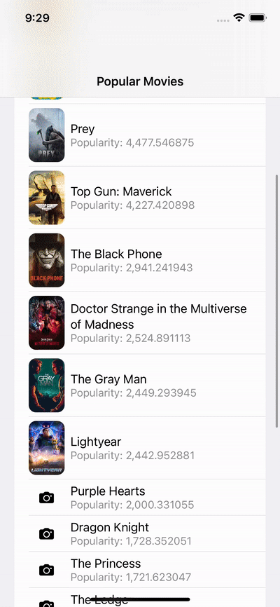

# This app demonstrates React Native intagration into SwiftUI iOS app

Note: This a demo project has been made to demonstrate the process of integrating React Native into existing mobile app. 

## Run the project 

1. [Install React Native CLI](https://reactnative.dev/docs/environment-setup) on your machine
2. Run `yarn install` to install all dependencies
3. Run `cd ios && pod install` to install all dependencies
4. Run `yarn start` in project root derectory to start Metro
5. Run XCode and build the project
6. Happy coding!

## Preview

