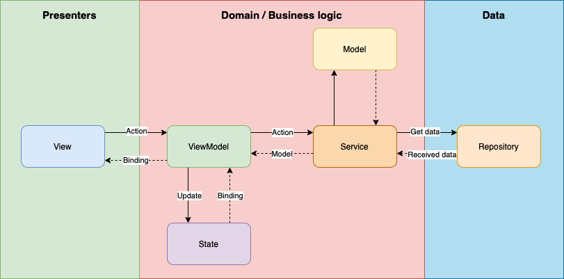
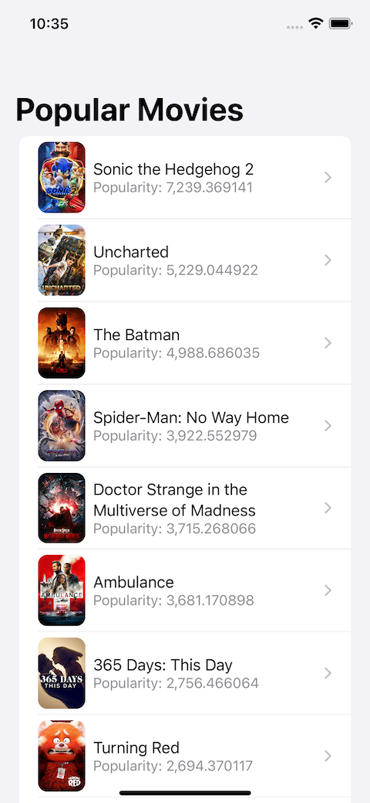
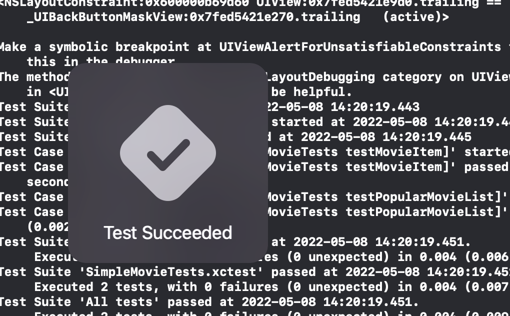

# Simple Movie SwiftUI Demo App

A demo project which is based on SwiftUI and build with MVVM and Clear Architecture in mind.

The app uses https://www.themoviedb.org REST API to get the data about movies

## MVVM + [The Clean Architecture](https://blog.cleancoder.com/uncle-bob/2012/08/13/the-clean-architecture.html)

## Description

This app has two screens. The main one is Popular Movie list screen which fetches the data from https://api.themoviedb.org `GET /movie/popular` endpoint and displays the list of movie items. The second screen displays the details of selected movie which receives `movieId` from the main screen then fetches the data from `GET
/movie/{movieId}` endpoint and displays the details

## Architecture Overview

## Overview

| Preview           | Live             |
|-------------------|------------------|
|   |  |

## Tests

 